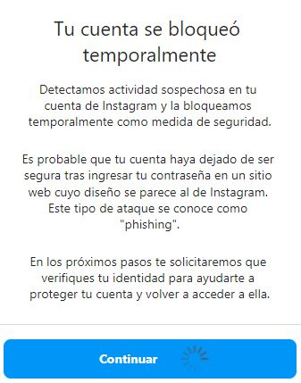

# Instalación y ejecución

1. Descargar e instalar python desde el siguiente link:

    [Link de descargas Python](https://www.python.org/downloads/)

2. Descargar los archivos "insta-unfollower.py" y "requirements.txt" desde el siguiente link:

    [insta-unfollower.py](https://drive.google.com/open?id=1JIMLpJ6ADX5VHkttwMCX5zmODvCPAYXy&authuser=daniel.arbelaez.alvarez%40gmail.com&usp=drive_fs)

    [requirements.txt](https://drive.google.com/open?id=1JDJGuwu5YKxK81dTavIZFb6rhS9J9yhy&authuser=daniel.arbelaez.alvarez%40gmail.com&usp=drive_fs)

3. Abrir la ventana de PowerShell desde la carpeta de descargas o en su defecto la que contenga los archivos descargados:

   ~~~~cmd
   Shift (:) + Click derecho
   ~~~~

4. Instalar desde PowerShell y por una sola vez los requerimientos para el buen funcionamiento del algoritmo con el siguiente comando:

    ~~~~cmd
    python -m pip install -r .\requirements.txt
    ~~~~

5. Ejecutar cada vez que se requiera desde la carpeta contenedora del programa y usar el siguiente comando desde la terminal

    ~~~~cmd
    python insta-unfollower.py USERNAME PASSWORD
    ~~~~

6. Al ejecutar la linea de comando:
   1. anterior por primera vez aparecerá el siguiente mensaje: "Please check Instagram app for a security confirmation that it is you trying to login".
   2. En caso positivo, al ingresar a tu cuenta de instagram aparecerá el siguiente mensaje, "Detectamos un intento de inicio de sesión inusual" y solicitará la confirmación de que has iniciado sesión desde otro dispositivo.
   3. Debes de seleccionar "Fui yo".
   4. Volver a ejecutar el punto 5 hast que aparezca el siguiente mensaje "You're now logged as usuario"
7. No cerrar la ventana de ejecución, solo para finalziar ejecución
8. Debes de ***ejecutar*** el algoritmo máximo 8 horas al día alcanzando alrededor de 200 unfollows.
9. La ejecución del algoritmo se recomienda realizar ***máximo*** durante 5 días, luego ***suspender*** el uso 1 o 2 días.
10. Los anteriores pasos fueron probados y actualizados para evitar el bloqueo de tu cuenta de instagram por **"Actividad sospechosa"**

---

## Bloqueo de cuenta

En caso de que te aparezca **"Tu cuenta se bloqueó temporalmente"**, deberás seguir los pasos que te indique instagram para volver acceder a ella; sin embargo, si sigues los pasos anteriormente descritos lo más probable es que no suceda.

---

## Créditos

[tuxity/insta-unfollower](https://github.com/tuxity/insta-unfollower)
